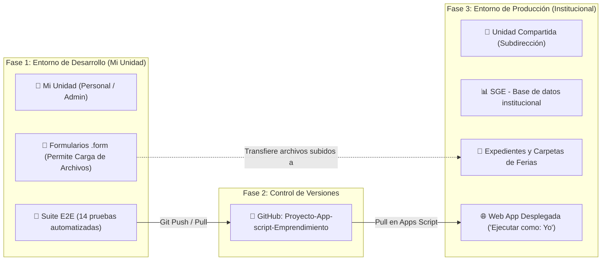

# DOCUMENTACIÓN MAESTRA DEL SISTEMA (SGE v2.1.0)
## Sistema de Gestión de Emprendimientos - Subdirección de Desarrollo Económico Local
### Ilustre Municipalidad de Santiago

---

> **PROPÓSITO DE ESTE DOCUMENTO**:
> Este archivo constituye la **fuente única de verdad técnica, funcional y metodológica** del proyecto SGE v2.1.0. Está diseñado para que cualquier ingeniero, desarrollador o modelo de Inteligencia Artificial (en Google AI Studio, Gemini, Antigravity, etc.) pueda comprender la arquitectura en su totalidad, replicar el sistema desde cero en un nuevo entorno, entender el porqué de cada decisión de diseño y continuar su desarrollo sin repetir errores del pasado.

---

## 📑 ÍNDICE GENERAL
1. **Ficha Técnica y Visión General**
2. **Problemas Históricos y Objetivos del Sistema**
3. **Arquitectura y Conexiones (El "Por qué" de cada componente)**
4. **Metodología de Trabajo: Desarrollo en "Mi Unidad" vs Despliegue en "Unidad Compartida"**
5. **Esquema Relacional de Base de Datos (16 Tablas)**
6. **Problemas Críticos Resueltos y Lecciones Aprendidas (Imprescindible para otra IA)**
7. **Guía Paso a Paso para Replicar el Proyecto desde Cero**
8. **Directrices de Desarrollo y Reglas Inviolables para Agentes de IA**

---

## 1. FICHA TÉCNICA Y VISIÓN GENERAL

* **Nombre Oficial**: Sistema de Gestión de Emprendimientos (SGE).
* **Versión Actual**: `v2.1.0 - Ficha Integral del Emprendedor`.
* **Entorno de Ejecución**: Google Apps Script (Runtime V8, JavaScript moderno ES6+).
* **Base de Datos**: Google Sheets estructurada relacionalmente (16 tablas con UUIDs y marcas temporales ISO 8601).
* **Almacenamiento Documental**: Google Drive API (Modelo de almacenamiento híbrido entre Unidad Compartida institucional y Mi Unidad).
* **Frontend**: Single Page Application (SPA) responsiva HTML5/CSS3/JavaScript nativo servida por `HtmlService`.
* **Seguridad y Control de Acceso**: RBAC simplificado integrado con sesiones OAuth de Google Workspace (`@munistgo.cl`).
* **Repositorio de Código**: `https://github.com/msegovia1/Proyecto-App-script-Emprendimiento` (Rama: `main`).

---

## 2. PROBLEMAS HISTÓRICOS Y OBJETIVOS DEL SISTEMA

Históricamente, la gestión de emprendedores y ferias en las municipalidades se realizaba con planillas Excel aisladas, correos electrónicos y formularios de Google sin centralización. Esto generaba cuatro graves problemas:

1. **Datos fragmentados y duplicación de identidades**:
   - Una misma persona postulaba con nombres ligeramente distintos o cambiaba de teléfono/correo en cada feria. No existía trazabilidad histórica de su trayectoria ni de sus formalizaciones.
2. **Cuestionamientos a la transparencia en la selección**:
   - Las convocatorias a ferias y mercados de alta demanda generaban sospechas de arbitrariedad ("asignación a dedo") por parte de los vecinos no seleccionados.
3. **Incapacidad de garantizar diversidad y rotación**:
   - Sin herramientas de pre-filtro, las ferias corrían el riesgo de saturarse de un solo rubro (ej. 80% gastronomía y 0% artesanía) o de beneficiar repetidamente a los mismos emprendedores en desmedro de quienes postulaban por primera vez.
4. **Colapso en la gestión documental**:
   - Cédulas, certificados de inicio de actividades del SII y Registros Sociales de Hogares se acumulaban en correos de funcionarios, perdiendo control de vigencias y consumiendo espacio innecesario con copias idénticas.

### ¿Qué resuelve el SGE v2.1.0?
* **Ficha Integral 360°**: Separa la entidad **Persona Natural** (ciudadano con RUT validado por Módulo 11) de la entidad **Emprendimiento** (unidad comercial), vinculándolas mediante relaciones $N:M$.
* **Motor de Pre-Filtro Inteligente**: Analiza en tiempo real las postulaciones a una feria, diagnostica los rubros postulados y calcula una pre-selección que garantiza equidad por rubro y rotación para emprendedores de primera postulación.
* **Selección Matemática Transparente y Auditable**: Emplea un algoritmo pseudoaleatorio basado en semillas numéricas reproducibles, generando actas inmutables defendibles ante el Concejo Municipal o Contraloría.
* **Bóveda Documental con Deduplicación Criptográfica**: Cada documento subido se identifica con un hash SHA-256; si el archivo ya existe físicamente en Drive, se reutiliza sin duplicar almacenamiento.

---

## 3. ARQUITECTURA Y CONEXIONES (EL "POR QUÉ" DE CADA COMPONENTE)

```mermaid
graph TD
    subgraph "Capas del Sistema SGE"
        UI["🖥️ Frontend: Web App SPA (HTML5/CSS/JS)"] -->|google.script.run (RPC)| CTRL["⚙️ Backend: Controladores (.gs)"]
        CTRL --> AUTH["🛡️ AuthService: RBAC y Auto-aprovisionamiento"]
        CTRL --> VAL["🔍 NormalizacionService: RUT Módulo 11 y Strings"]
        CTRL --> REPO["💾 Repository: Capa de Persistencia y Caché"]
        
        REPO -->|Lecturas/Escrituras por Lotes| SHEETS["📊 Google Sheets: Base de Datos Relacional (16 tablas)"]
        CTRL -->|Gestión de Archivos y Expedientes| DRIVE["📁 Google Drive API: Unidad Compartida"]
        CTRL -->|Formularios Convocatorias Públicas| FORMS["📋 Google Forms: 'Mi Unidad'"]
    end
```

### ¿Por qué Google Sheets como Base de Datos?
1. **Cero costo de infraestructura de servidores**: Opera dentro de la cuota de Google Workspace institucional.
2. **Acceso de contingencia para funcionarios**: En caso de auditoría o exportaciones masivas, los directivos pueden inspeccionar directamente las tablas sin necesidad de clientes SQL externos.
3. **Integridad Transaccional Mediante Bloqueos**: Se utiliza `LockService.getScriptLock()` en operaciones críticas para prevenir condiciones de carrera (race conditions) durante postulaciones masivas simultáneas.

### ¿Por qué Google Drive para Documentos?
* Google Drive permite gestionar permisos institucionales de retención de datos. El sistema organiza carpetas dinámicas por feria (`Mercados/[Nombre]/Seleccionados/[Emprendimiento]`), de modo que al seleccionarse un emprendedor, sus documentos se copian automáticamente a la carpeta de la feria correspondiente.

---

## 4. METODOLOGÍA DE TRABAJO: DESARROLLO EN "MI UNIDAD" VS DESPLIEGUE EN "UNIDAD COMPARTIDA"

Este es uno de los aspectos más importantes del proyecto:



### La Regla de Oro del Entorno:
* **En "Mi Unidad" (Cuenta Administradora)**:
  - Se alojan los archivos de formularios de Google (`.form`) en la carpeta `SGE - Formularios Convocatorias`.
  - **Razón**: Google Forms **bloquea** la función de *"Carga de archivos"* si el archivo del formulario reside en una Unidad Compartida (Shared Drive). Al residir en "Mi Unidad", Google permite la subida libre de archivos.
* **En la "Unidad Compartida" (Subdirección)**:
  - Se aloja la **Planilla de Base de Datos (Google Sheets)** y la **Carpeta Raíz de Expedientes (`Sistema de Gestión de Emprendimientos`)**.
  - **Razón**: Toda la información comunal, expedientes y registros permanecen respaldados a nivel de subdirección, sin depender del almacenamiento personal de ningún funcionario.
* **El Puente Automático**:
  - Cuando un vecino llena el formulario público en "Mi Unidad" y adjunta su cédula o RSH, un trigger de Apps Script captura el archivo y lo **traslada inmediatamente a la Unidad Compartida institucional** dentro de la carpeta del emprendedor.

---

## 5. ESQUEMA RELACIONAL DE BASE DE DATOS (16 TABLAS)

Cada tabla posee claves primarias UUID v4 (`Utilities.getUuid()`), marcas `CREADO_EN`/`ACTUALIZADO_EN` en formato ISO 8601 (`America/Santiago`) y auditoría de usuario:

| # | Nombre de Tabla | Clave Primaria | Propósito y Relaciones |
| :-: | :--- | :--- | :--- |
| 1 | **`PERSONAS`** | `ID_PERSONA` | Ciudadano. Contiene RUT normalizado Módulo 11 (`12345678-9`), nombres, fecha nacimiento, género, discapacidad, comuna. |
| 2 | **`EMPRENDIMIENTOS`** | `ID_EMPRENDIMIENTO` | Negocio. Código comercial, nombre de fantasía, rubro, subrubro, formalización SII, etapa madurez, redes sociales. |
| 3 | **`PERSONA_EMPRENDIMIENTO`** | `ID_RELACION` | Tabla asociativa $N:M$. Conecta Persona con Emprendimiento (Roles: `TITULAR`, `SOCIO`; marca `ES_PRINCIPAL`). |
| 4 | **`DOCUMENTOS`** | `ID_DOCUMENTO` | Bóveda documental. Vincula `ID_SUJETO` (Persona o Emprendimiento), `ID_ARCHIVO_DRIVE`, `HUELLA_ARCHIVO` (SHA-256), `ES_VERSION_VIGENTE` (`SI`/`NO`), `ESTADO_REVISION`. |
| 5 | **`INICIATIVAS`** | `ID_INICIATIVA` | Convocatorias, ferias o mercados. Cupos titulares, cupos suplentes, fechas ejecución, URL formulario. |
| 6 | **`POSTULACIONES`** | `ID_POSTULACION` | Postulación a una iniciativa. Conecta `ID_INICIATIVA`, `ID_EMPRENDIMIENTO`, `ID_PERSONA_CONTACTO`, estado (`INGRESADA`, `ADMISIBLE`, `SELECCIONADA`, etc.). |
| 7 | **`CRITERIOS_ADMISIBILIDAD`** | `ID_CRITERIO` | Parámetros de filtro por iniciativa (comuna exclusiva, formalización obligatoria, rubro permitido, etc.). |
| 8 | **`EVALUACIONES_CRITERIO`** | `ID_EVALUACION` | Resultado detallado de evaluación de cada postulación frente a cada criterio. |
| 9 | **`PROCESOS_SELECCION`** | `ID_PROCESO` | Registro inmutable de cada sorteo o selección (Semilla numérica, huella criptográfica del universo admisible, ejecutor). |
| 10 | **`RESULTADOS_SELECCION`** | `ID_RESULTADO` | Nómina ordenada resultante (`TITULAR`, `SUPLENTE`, `NO_SELECCIONADO`, posición 1..N). |
| 11 | **`UNIVERSO_SELECCION`** | `ID_UNIVERSO` | Instantánea (snapshot) de todas las postulaciones que integraron el proceso de selección. |
| 12 | **`CONFIRMACIONES_PARTICIPACION`**| `ID_CONFIRMACION` | Asistencia, desistimientos y reemplazo automático en cascada por suplente #1. |
| 13 | **`SEGUIMIENTO_POST_MERCADO`** | `ID_SEGUIMIENTO` | Métricas de impacto tras la feria (ventas declaradas, nuevos clientes, seguidores ganados). |
| 14 | **`USUARIOS`** | `ID_USUARIO` | Padrón de funcionarios, correos institucionales `@munistgo.cl`, nombres y roles (`ADMIN`, `GESTOR`). |
| 15 | **`AUDITORIA`** | `ID_AUDITORIA` | Bitácora inmutable de todas las mutaciones críticas (usuario, entidad, payload previo y nuevo). |
| 16 | **`CONFIGURACION`** | `CLAVE` | Claves globales (Versión del sistema, ID de base de datos, ID de carpeta Drive, ID plantilla). |

---

## 6. PROBLEMAS CRÍTICOS RESUELTOS Y LECCIONES APRENDIDAS (PARA OTRA IA)

> [!CAUTION]
> **LEER ANTES DE TOCAR EL CÓDIGO**:
> Los siguientes 6 problemas costaron horas de depuración y representan restricciones directas de la plataforma Google Workspace. Cualquier modificación futura DEBE respetar estas soluciones.

---

### Problema 1: Colisión de Variables Globales en Apps Script V8
* **Síntoma**: Error fatal en tiempo de carga: `SyntaxError: Identifier '_usuarioActualCache' has already been declared`.
* **Causa Raíz**: En Google Apps Script no existen módulos aislados; todos los archivos `.gs` se concatenan en un único contexto global en tiempo de ejecución. Si se usa `let` o `const` en el ámbito superior (top-level) de un archivo `.gs`, cualquier recarga o coincidencia de nombres arroja colisión de declaración.
* **Regla Inviolable**: **Declarar todas las variables globales y cachés de nivel superior con `var`**, nunca con `let` ni `const` en el scope global.
  ```javascript
  // CORRECTO:
  var _usuarioActualCache = null;
  var _mapasPostulacionesCache = null;

  // PROHIBIDO en ámbito global de .gs:
  // let _usuarioActualCache = null;
  ```

---

### Problema 2: `makeCopy()` de Formularios Rompe la Carga de Archivos
* **Síntoma**: Al clonar un formulario con preguntas de tipo "Carga de archivos", al abrirlo aparece el error: *"Faltan carpetas de Carga de archivos"* y el formulario queda en estado `closedform` ("Ya no acepta respuestas").
* **Causa Raíz**: Google Forms API no permite crear preguntas de subida de archivos programáticamente. Al usar `DriveApp.getFileById(id).makeCopy()`, Google Forms desconecta la carpeta interna de Drive vinculada a las preguntas de archivos y desactiva el formulario por seguridad hasta que un humano entra a la UI y hace clic en "Restablecer".
* **Soluciones Implementadas**:
  1. Los formularios clonados se ubican en **"Mi Unidad"** en la carpeta `SGE - Formularios Convocatorias` (en Unidades Compartidas Google Forms directamente prohíbe la subida).
  2. En el código de habilitación se fuerza:
     ```javascript
     function habilitarRespuestasFormulario_(form) {
       try { form.setRequireLogin(false); } catch (ignored) {}
       try { form.setLimitOneResponsePerUser(false); } catch (ignored) {}
       form.setAcceptingResponses(true);
       return form;
     }
     ```
  3. Para evitar clonaciones repetitivas, el sistema cuenta con el **Asistente de Pre-Filtro** que permite reutilizar formularios o gestionarlos de forma continua.

---

### Problema 3: Restricción de Dominio Institucional en Formularios Públicos
* **Síntoma**: Emprendedores externos recibían: *"Necesitas permiso. Este formulario solo se puede ver dentro de Ilustre Municipalidad de Santiago"*.
* **Causa Raíz**: Las directivas de Workspace imponen por defecto `setRequireLogin(true)`.
* **Solución**: Todo formulario público creado por el sistema ejecuta explícitamente `form.setRequireLogin(false)` para que cualquier vecino pueda postular sin necesidad de cuenta municipal ni de Google.

---

### Problema 4: Rendimiento y Cuotas de Apps Script (Límite de 6 Minutos)
* **Síntoma**: La carga del Dashboard y el cálculo de KPIs tardaban más de 20 segundos o excedían el tiempo límite de ejecución.
* **Causa Raíz**: Consultas $O(N \times M)$ con llamadas celda por celda o invocaciones repetitivas a `repoBuscarPorId` dentro de bucles.
* **Solución Implementada**:
  - **Lectura en lote**: Se lee la hoja completa con `sheet.getDataRange().getValues()` en una sola llamada de red.
  - **Indexación Hash $O(1)$**: Se pre-agrupan los datos en mapas en memoria (`_mapasPostulacionesCache`, `docsPorPersonaMap`, `postsPorIniciativa`).
  - **Búsqueda reactiva frontend con Debounce (300ms)**: Los buscadores de Fichas, Mercados y Postulaciones filtran en memoria local sin saturar el backend.

---

### Problema 5: Modelo de Acceso y RBAC Simplificado
* **Síntoma**: Nuevos funcionarios municipales ingresaban a la Web App y veían pantalla blanca o error de *"Usuario no autorizado"*.
* **Causa Raíz**: El sistema anterior exigía que un administrador diera de alta previamente a cada colega en la tabla `USUARIOS`.
* **Solución**:
  - `msegovia@munistgo.cl` está registrado de forma permanente con rol `ADMIN` (permisos comodín `['*']`).
  - **Auto-aprovisionamiento**: Cualquier funcionario que inicie sesión con correo institucional `@munistgo.cl` es registrado automáticamente en su primer acceso con el rol `GESTOR`, otorgándole acceso operativo completo (crear fichas, gestionar ferias, subir documentos y seleccionar candidatos) sin trámites manuales.

---

### Problema 6: Asistente de Pre-Filtro y Cuotas por Rubro (Rotación vs Sorteo Ciego)
* **Síntoma**: Los funcionarios necesitaban ponderar postulaciones para evitar ferias homogéneas (muchos puestos de lo mismo) y dar oportunidad a quienes nunca habían participado.
* **Solución Implementada**:
  - Función backend `apiDiagnosticoYPreseleccionMercado(idIniciativa, config)`.
  - Calcula en tiempo real la distribución por rubros y candidatos de primera vez.
  - El botón frontend `⚡ Pre-selección inteligente (Rubros + Rotación)` pre-marca a los titulares y suplentes asegurando diversidad de rubros y rotación equitativa, dejando al funcionario el control humano final para guardar el acta oficial.

---

## 7. GUÍA PASO A PASO PARA REPLICAR EL PROYECTO DESDE CERO

Si necesitas replicar este sistema completo en otra cuenta, subdirección o municipio, sigue estos pasos exactos:

### Paso 1: Clonar el Repositorio de Código
1. En tu máquina local o entorno de trabajo:
   ```bash
   git clone https://github.com/msegovia1/Proyecto-App-script-Emprendimiento.git
   cd Proyecto-App-script-Emprendimiento
   ```

### Paso 2: Crear el Proyecto en Google Workspace
1. Crea una **Hoja de cálculo en blanco** en Google Drive institucional y nómbrala: `SGE - Base de datos institucional`.
2. En la hoja, ve al menú superior: **Extensiones > Apps Script**.
3. Nombra el proyecto Apps Script: `SGE - Sistema de Gestión de Emprendimientos`.

### Paso 3: Sincronizar el Código
* **Opción A (Recomendada con Extensión de Chrome)**:
  - Instala la extensión oficial **GitHub Assistant for Apps Script**.
  - Vincula tu repositorio `msegovia1/Proyecto-App-script-Emprendimiento` en la rama `main`.
  - Presiona **Pull (⬇️)** para descargar todos los archivos de `src/backend/` y `src/frontend/`.
* **Opción B (Con Google Clasp)**:
  - Inicializa con `clasp clone <SCRIPT_ID>` y ejecuta `clasp push`.

### Paso 4: Inicializar la Base de Datos y Carpetas
1. En el editor de Apps Script, abre el archivo `src/backend/Instalador.gs`.
2. En el selector de funciones arriba, elige **`instalarEnHojaActiva`** y presiona **Ejecutar ▶️**.
3. Concede los permisos de Google Workspace solicitados.
4. El script:
   - Formateará automáticamente las **16 tablas** con encabezados azul municipal (`#215783`).
   - Cargará los 28 catálogos iniciales (rubros, subrubros, géneros, etapas).
   - Creará la carpeta raíz `Sistema de Gestión de Emprendimientos` en Google Drive con sus 6 subcarpetas.
   - Registrará al usuario actual como `ADMIN`.

### Paso 5: Validar con la Suite E2E Automatizada
1. Abre el archivo `src/backend/Tests.gs`.
2. Selecciona la función **`ejecutarPruebasIntegralesEndToEnd`** y haz clic en **Ejecutar ▶️**.
3. Inspecciona el panel de registro (Logs). Debe mostrar:  
   `📊 RESUMEN FINAL: 14 PASARON, 0 FALLARON DE 14 PRUEBAS`.

### Paso 6: Desplegar la Aplicación Web
1. Arriba a la derecha, haz clic en **Implementar > Nueva implementación**.
2. Tipo: **Aplicación web**.
3. Configuración obligatoria:
   - **Descripción**: `v2.1.0 Producción`
   - **Ejecutar como**: **Yo (`tu_correo@munistgo.cl`)**
   - **Quién tiene acceso**: **Cualquier usuario de [Tu Organización]**
4. Haz clic en **Implementar**, copia la URL resultante (`.../exec`) y compártela con los funcionarios.

---

## 8. DIRECTRICES DE DESARROLLO Y REGLAS INVIOLABLES PARA AGENTES DE IA

Si eres un modelo de Inteligencia Artificial (en Google AI Studio, Gemini, Antigravity u otro entorno) y vas a generar o modificar código para este sistema, **debes cumplir estrictamente estas 7 reglas**:

1. **Sin Sintaxis de Módulos Node.js**:
   - Apps Script V8 no soporta `import`, `export`, `require()` ni `module.exports`. Todo archivo `.gs` expone sus funciones en el ámbito global.
2. **Uso Exclusivo de `var` en Variables Globales**:
   - Prohibido usar `let` o `const` en variables de nivel superior de los archivos `.gs`. Usa siempre `var` para cachés o configuraciones globales para evitar colisiones entre archivos.
3. **Persistencia Exclusiva vía Capa Repository**:
   - No llames a métodos crudos de Sheets (`sheet.appendRow()`, `sheet.getRange()`) en los servicios de negocio (`PersonaService`, `MercadosService`, etc.). Usa siempre las funciones de abstracción:
     - `repoInsertar(tabla, data)`
     - `repoBuscarPorId(tabla, id)`
     - `repoActualizar(tabla, id, changes, meta)`
     - `repoListar(tabla, query)`
     - `repoTodos(tabla, opts)`
4. **Respuestas Estandarizadas**:
   - Todo endpoint de API remota debe retornar usando los wrappers estandarizados:
     - `return respuestaOk(datos);`
     - `return manejarError_(error, 'nombreFuncion');`
5. **Normalización Estricta de Identidades**:
   - Todo RUT chileno debe pasar por `validarRut_()` y `normalizarRut_()` (formato sin puntos y con guion: `12345678-K`).
6. **Manejo de Zona Horaria**:
   - La zona horaria del sistema está fijada en `America/Santiago`. Toda fecha y hora debe formatearse con `ahoraIso_()` o `Utilities.formatDate(date, APP.TIMEZONE, ...)`.
7. **Arquitectura de Archivos**:
   - Respeta la jerarquía modular:
     - `src/backend/*.gs`: Lógica de negocio pura, acceso a datos y endpoints RPC.
     - `src/frontend/Index.html`: Estructura HTML de la SPA y menú lateral.
     - `src/frontend/Styles.html`: Variables CSS y componentes visuales.
     - `src/frontend/Scripts.html`: Controladores de interfaz, llamadas asíncronas con `call('nombreApi', ...)` y renderizado reactivo.
