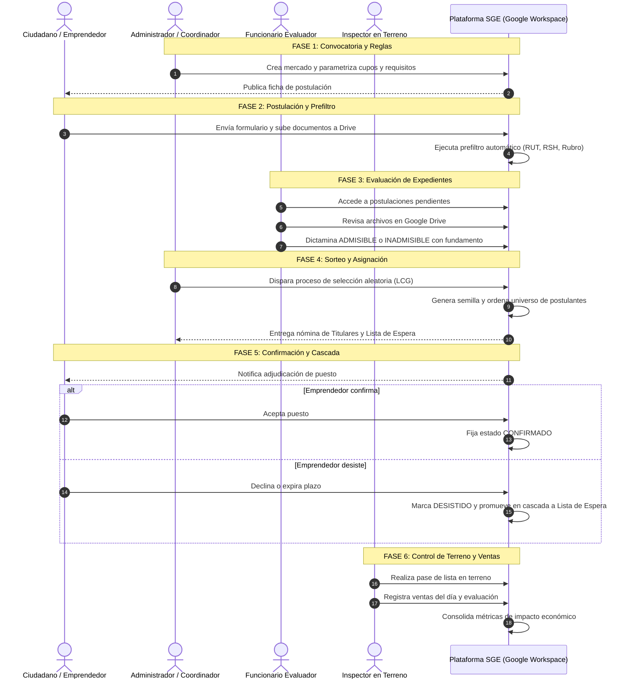

# FLUJOGRAMA OPERATIVO DEL PERSONAL MUNICIPAL
## Proceso de Gestión, Selección y Operación de Mercados de Emprendimiento (SGE v2.1.0)

> **Documento:** Flujograma Operativo Funcionario  
> **Destinatario:** Dirección de Informática / Dirección de Desarrollo Comunitario (DIDECO)  
> **Herramienta de Diagramación:** Mermaid GFM Compliant  

---

## 1. Visión General del Proceso Operativo

El trabajo de los funcionarios municipales en el SGE se articula en **6 etapas consecutivas**, orientadas a maximizar la eficiencia administrativa, eliminar la discrecionalidad y asegurar la transparencia total en la asignación de espacios públicos de comercialización:

---

## 2. Diagrama de Flujo Integral (BPMN Funcionario)

A continuación se detalla el flujo de trabajo completo que realizan los funcionarios desde la creación del mercado hasta la auditoría de ventas en terreno:

```mermaid
flowchart TD
    Start(["Inicio: Planificación del Mercado"]) --> F1["Funcionario: Crear Iniciativa en SGE"]
    F1 --> F2["Definir Parámetros del Mercado:<br/>- Cupos totales y por rubro<br/>- Fechas de evento y plazo postulación<br/>- Requisitos excluyentes (RSH, SII, SEREMI)"]
    F2 --> F3["Publicar Convocatoria a la Comunidad"]
    
    F3 --> P1["Postulación Ciudadana<br/>(Google Forms / Ventanilla SGE)"]
    P1 --> P2["Ingesta Automática de Datos y Expediente"]
    
    P2 --> PF1{"Ejecución de Prefiltro Automático"}
    PF1 -- "No cumple requisitos críticos<br/>(RSH sobre umbral, sin resolución en comida)" --> PF_RECHAZO["Estado: Inadmisible Automático<br/>(Se registra causal objetiva)"]
    PF1 -- "Cumple requisitos base" --> PF_OK["Estado: Postulación Admisible Previa"]
    
    PF_OK --> EV1["Funcionario Revisor:<br/>Abrir Módulo de Admisibilidad"]
    EV1 --> EV2["Auditar Expediente en Google Drive:<br/>- Verificar Cartola RSH vigente<br/>- Constatar Resolución Sanitaria si aplica<br/>- Revisar fotos de productos elaborados"]
    
    EV2 --> EV3{"Dictamen del Funcionario"}
    EV3 -- "Inconsistencia / Falsedad" --> EV_RECHAZADO["Marcar: INADMISIBLE<br/>(Ingresar fundamento en acta)"]
    EV3 -- "Documentación Fidedigna" --> EV_APROBADO["Marcar: ADMISIBLE FINAL<br/>(Habilitado para Sorteo)"]
    
    EV_APROBADO --> S1["Cierre de Plazo de Convocatoria"]
    S1 --> S2["Funcionario Coordinador:<br/>Abrir Módulo de Sorteo LCG"]
    S2 --> S3["Generar Semilla Criptográfica Auditable"]
    S3 --> S4["Ejecutar Algoritmo LCG de Asignación"]
    
    S4 --> S5["Emisión de Resultados Oficiales:<br/>- Titulares Asignados (Cupo 1 a N)<br/>- Lista de Espera Ordenada (N+1 a M)"]
    S5 --> S6["Publicación de Acta con Semilla de Auditoría"]
    
    S6 --> C1["Notificar a Postulantes Seleccionados"]
    C1 --> C2["Plazo de Confirmación de Cupo (48-72 hrs)"]
    
    C2 --> C3{"¿El Emprendedor Confirma?"}
    C3 -- "SÍ: Confirma Asistencia" --> C4["Estado: CONFIRMADO<br/>Asignar Número de Stand / Toldo"]
    C3 -- "NO: Desiste o Vence Plazo" --> C5["Estado: DESISTIDO"]
    
    C5 --> CASCADA["ALGORITMO DE CASCADA:<br/>1. Tomar Postulante #1 de Lista de Espera<br/>2. Promoverlo automáticamente a TITULAR<br/>3. Enviar Citación con plazo perentorio"]
    CASCADA --> C3
    
    C4 --> T1["Día del Evento: Inspectores en Terreno"]
    T1 --> T2["Pase de Asistencia Digital en Tablet/Celular"]
    T2 --> T3{"¿Titular se Presentó?"}
    T3 -- "SÍ" --> T4["Confirmar Instalación Efectiva"]
    T3 -- "NO (Falta Injustificada)" --> T5["Registrar Inasistencia:<br/>Sanción reglamentaria en historial"]
    
    T4 --> T6["Supervisión Diaria en Feria"]
    T6 --> T7["Módulo de Seguimiento Masivo:<br/>Digitar ventas diarias declaradas ($ CLP)"]
    T7 --> T8["Evaluar Desempeño y Cumplimiento de Normas"]
    
    T8 --> FIN(["Cierre de Iniciativa y Reporte Ejecutivo a Alcaldía"])
    PF_RECHAZO --> FIN_RECHAZO(["Notificación de Inadmisibilidad al Ciudadano"])
    EV_RECHAZADO --> FIN_RECHAZO
```

---

## 3. Matriz de Responsabilidades por Rol de Funcionario

---

## 4. Descripción Operativa de las 6 Fases

### Fase 1: Parametrización y Convocatoria
- **Actor:** Coordinador de Fomento Productivo.
- **Acción:** Define la fecha de apertura, cierre, número de puestos disponibles y criterios de exclusión.
- **Ventaja SGE:** Evita la creación de planillas manuales desconectadas; toda la parametrización se almacena en la tabla `INICIATIVAS` y `REQUISITOS`.

### Fase 2: Prefiltro y Control Antifraude
- **Actor:** Sistema automatizado SGE.
- **Acción:** Valida que el RUT sea matemáticamente correcto (Módulo 11), verifica que no existan postulaciones duplicadas del mismo titular o emprendimiento, y constata que el rubro postulado coincida con la vocación de la feria.
- **Ventaja SGE:** Reduce en más de un 60% la carga de trabajo manual del equipo evaluador.

### Fase 3: Evaluación Técnica de Expedientes
- **Actor:** Funcionarios Evaluadores.
- **Acción:** Acceden al visualizador de expedientes que conecta directamente con la carpeta de Google Drive institucional del emprendedor. Verifican la vigencia de la Cartola RSH y la Resolución Sanitaria.
- **Ventaja SGE:** Trazabilidad total de quién aprobó o rechazó cada postulación, registrando nombre de funcionario, fecha y motivo en la tabla `POSTULACIONES`.

### Fase 4: Sorteo Digital Transparente (LCG)
- **Actor:** Coordinador de Fomento / Notario Municipal / Ministro de Fe.
- **Acción:** Con un solo clic, se ejecuta el sorteo con una semilla matemática inmutable. El sistema genera la lista de titulares y la lista de espera ordenada.
- **Ventaja SGE:** Transparencia absoluta ante reclamos de concejales o dirigentes gremiales. El proceso es 100% reproducible y auditable.

### Fase 5: Confirmación de Puestos y Algoritmo de Cascada
- **Actor:** Funcionarios Administrativos.
- **Acción:** Controlan la recepción de confirmaciones. Si un adjudicatario no se contacta o no asiste a la inducción obligatoria, el sistema realiza la promoción en cascada del primer postulante de la lista de espera sin alterar el orden original.
- **Ventaja SGE:** Ningún cupo municipal queda ocioso ni se asigna por favoritismo.

### Fase 6: Operación en Terreno y Seguimiento Económico
- **Actor:** Inspectores y Técnicos en Terreno.
- **Acción:** Utilizan tablets o teléfonos móviles para pasar lista al inicio de la jornada. Al cierre del día, registran las ventas brutas declaradas de cada puesto en el módulo de seguimiento masivo.
- **Ventaja SGE:** Permite generar reportes inmediatos para la Alcaldía con el impacto económico real, total de ventas inyectadas a la economía local y tasa de asistencia efectiva.
