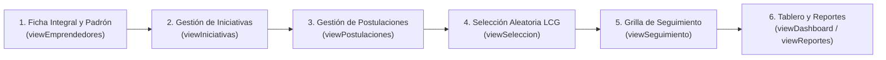
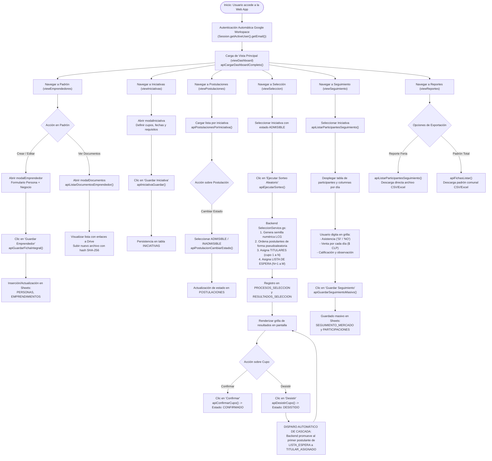
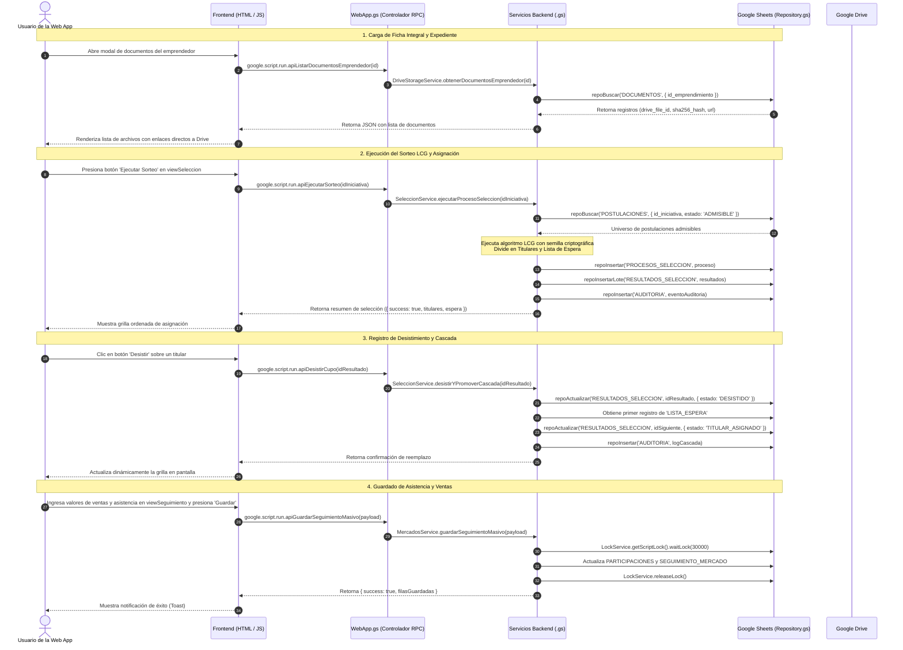

# FLUJOGRAMA DE OPERACIÓN DEL SISTEMA Y GESTIÓN DE DATOS
## Interacción con la Aplicación Web y Flujo de Información (SGE v2.1.0)

> **Documento:** Flujograma Operativo del Sistema  
> **Destinatario:** Dirección de Informática  
> **Alcance:** Exclusivamente las interfaces, eventos de usuario y operaciones de datos implementadas en el sistema.  
> **Herramienta de Diagramación:** Mermaid GFM Compliant  

---

## 1. Módulos Operativos de la Aplicación Web

El sistema implementa **6 interfaces operativas** interconectadas que gestionan el ciclo completo de los datos:

```mermaid
flowchart LR
    M1["1. Ficha Integral y Padrón<br/>(viewEmprendedores)"] --> M2["2. Gestión de Iniciativas<br/>(viewIniciativas)"]
    M2 --> M3["3. Gestión de Postulaciones<br/>(viewPostulaciones)"]
    M3 --> M4["4. Selección Aleatoria LCG<br/>(viewSeleccion)"]
    M4 --> M5["5. Grilla de Seguimiento<br/>(viewSeguimiento)"]
    M5 --> M6["6. Tablero y Reportes<br/>(viewDashboard / viewReportes)"]
```

---

## 2. Diagrama de Flujo de Operación y Eventos del Sistema

Este diagrama detalla las acciones del usuario en pantalla y los procesos de datos disparados en el backend:

```mermaid
flowchart TD
    Start(["Inicio: Usuario accede a la Web App"]) --> LOGIN["Autenticación Automática Google Workspace<br/>(Session.getActiveUser().getEmail())"]
    LOGIN --> DASH["Carga de Vista Principal (viewDashboard)<br/>apiCargarDashboardCompleto()"]
    
    %% Módulo 1: Padrón y Ficha Integral
    DASH --> NAV1["Navegar a Padrón (viewEmprendedores)"]
    NAV1 --> EMP_ACT{"Acción en Padrón"}
    EMP_ACT -- "Crear / Editar" --> MODAL_EMP["Abrir modalEmprendedor<br/>Formulario Persona + Negocio"]
    MODAL_EMP --> SAVE_EMP["Clic en 'Guardar Emprendedor'<br/>apiGuardarFichaIntegral()"]
    SAVE_EMP --> DB_EMP["Inserción/Actualización en Sheets:<br/>PERSONAS, EMPRENDIMIENTOS"]
    
    EMP_ACT -- "Ver Documentos" --> MODAL_DOC["Abrir modalDocumentos<br/>apiListarDocumentosEmprendedor()"]
    MODAL_DOC --> VIEW_DOC["Visualizar lista con enlaces a Drive<br/>Subir nuevo archivo con hash SHA-256"]
    
    %% Módulo 2: Iniciativas
    DASH --> NAV2["Navegar a Iniciativas (viewIniciativas)"]
    NAV2 --> MODAL_INI["Abrir modalIniciativa<br/>Definir cupos, fechas y requisitos"]
    MODAL_INI --> SAVE_INI["Clic en 'Guardar Iniciativa'<br/>apiIniciativaGuardar()"]
    SAVE_INI --> DB_INI["Persistencia en tabla INICIATIVAS"]
    
    %% Módulo 3: Postulaciones
    DASH --> NAV3["Navegar a Postulaciones (viewPostulaciones)"]
    NAV3 --> LIST_POST["Cargar lista por iniciativa<br/>apiPostulacionesPorIniciativa()"]
    LIST_POST --> EVAL_POST{"Acción sobre Postulación"}
    EVAL_POST -- "Cambiar Estado" --> SET_ESTADO["Seleccionar ADMISIBLE / INADMISIBLE<br/>apiPostulacionCambiarEstado()"]
    SET_ESTADO --> DB_POST["Actualización de estado en POSTULACIONES"]
    
    %% Módulo 4: Selección LCG
    DASH --> NAV4["Navegar a Selección (viewSeleccion)"]
    NAV4 --> SEL_INI["Seleccionar Iniciativa con estado ADMISIBLE"]
    SEL_INI --> BTN_SORTEO["Clic en 'Ejecutar Sorteo Aleatorio'<br/>apiEjecutarSorteo()"]
    BTN_SORTEO --> PROC_LCG["Backend SeleccionService.gs:<br/>1. Genera semilla numérica LCG<br/>2. Ordena postulantes de forma pseudoaleatoria<br/>3. Asigna TITULARES (cupo 1 a N)<br/>4. Asigna LISTA DE ESPERA (N+1 a M)"]
    PROC_LCG --> DB_SEL["Registro en PROCESOS_SELECCION<br/>y RESULTADOS_SELECCION"]
    DB_SEL --> RENDER_RES["Renderizar grilla de resultados en pantalla"]
    
    RENDER_RES --> ACC_CUPO{"Acción sobre Cupo"}
    ACC_CUPO -- "Confirmar" --> CONF_CUPO["Clic en 'Confirmar'<br/>apiConfirmarCupo() -> Estado: CONFIRMADO"]
    ACC_CUPO -- "Desistir" --> DES_CUPO["Clic en 'Desistir'<br/>apiDesistirCupo() -> Estado: DESISTIDO"]
    DES_CUPO --> CASCADE["DISPARO AUTOMÁTICO DE CASCADA:<br/>Backend promueve al primer postulante de<br/>LISTA_ESPERA a TITULAR_ASIGNADO"]
    CASCADE --> RENDER_RES
    
    %% Módulo 5: Seguimiento y Ventas
    DASH --> NAV5["Navegar a Seguimiento (viewSeguimiento)"]
    NAV5 --> LOAD_GRID["Seleccionar Iniciativa<br/>apiListarParticipantesSeguimiento()"]
    LOAD_GRID --> RENDER_GRID["Desplegar tabla de participantes y columnas por día"]
    RENDER_GRID --> INPUT_DATA["Usuario digita en grilla:<br/>- Asistencia ('SI' / 'NO')<br/>- Venta por cada día ($ CLP)<br/>- Calificación y observación"]
    INPUT_DATA --> BTN_SAVE_SEG["Clic en 'Guardar Seguimiento'<br/>apiGuardarSeguimientoMasivo()"]
    BTN_SAVE_SEG --> DB_SEG["Guardado masivo en Sheets:<br/>SEGUIMIENTO_MERCADO y PARTICIPACIONES"]
    
    %% Módulo 6: Dashboard y Reportes
    DASH --> NAV6["Navegar a Reportes (viewReportes)"]
    NAV6 --> EXP_DATA{"Opciones de Exportación"}
    EXP_DATA -- "Reporte Feria" --> CSV_MKT["apiListarParticipantesSeguimiento()<br/>Descarga directa archivo CSV/Excel"]
    EXP_DATA -- "Padrón Total" --> CSV_PAD["apiFichasListar()<br/>Descarga padrón comunal CSV/Excel"]
```

---

## 3. Diagrama de Secuencia de Interacción de Datos

Este diagrama representa el intercambio técnico de mensajes entre el usuario en el navegador y los servicios de almacenamiento:

```mermaid
sequenceDiagram
    autonumber
    actor U as Usuario de la Web App
    participant UI as Frontend (HTML / JS)
    participant RPC as WebApp.gs (Controlador RPC)
    participant Svc as Servicios Backend (.gs)
    participant DB as Google Sheets (Repository.gs)
    participant Drive as Google Drive

    %% Caso 1: Carga y Consulta
    Note over U, DB: 1. Carga de Ficha Integral y Expediente
    U->>UI: Abre modal de documentos del emprendedor
    UI->>RPC: google.script.run.apiListarDocumentosEmprendedor(id)
    RPC->>Svc: DriveStorageService.obtenerDocumentosEmprendedor(id)
    Svc->>DB: repoBuscar('DOCUMENTOS', { id_emprendimiento })
    DB-->>Svc: Retorna registros (drive_file_id, sha256_hash, url)
    Svc-->>UI: Retorna JSON con lista de documentos
    UI-->>U: Renderiza lista de archivos con enlaces directos a Drive

    %% Caso 2: Sorteo y Selección
    Note over U, DB: 2. Ejecución del Sorteo LCG y Asignación
    U->>UI: Presiona botón 'Ejecutar Sorteo' en viewSeleccion
    UI->>RPC: google.script.run.apiEjecutarSorteo(idIniciativa)
    RPC->>Svc: SeleccionService.ejecutarProcesoSeleccion(idIniciativa)
    Svc->>DB: repoBuscar('POSTULACIONES', { id_iniciativa, estado: 'ADMISIBLE' })
    DB-->>Svc: Universo de postulaciones admisibles
    Note over Svc: Ejecuta algoritmo LCG con semilla criptográfica<br/>Divide en Titulares y Lista de Espera
    Svc->>DB: repoInsertar('PROCESOS_SELECCION', proceso)
    Svc->>DB: repoInsertarLote('RESULTADOS_SELECCION', resultados)
    Svc->>DB: repoInsertar('AUDITORIA', eventoAuditoria)
    Svc-->>UI: Retorna resumen de selección ({ success: true, titulares, espera })
    UI-->>U: Muestra grilla ordenada de asignación

    %% Caso 3: Desistimiento y Reemplazo en Cascada
    Note over U, DB: 3. Registro de Desistimiento y Cascada
    U->>UI: Clic en botón 'Desistir' sobre un titular
    UI->>RPC: google.script.run.apiDesistirCupo(idResultado)
    RPC->>Svc: SeleccionService.desistirYPromoverCascada(idResultado)
    Svc->>DB: repoActualizar('RESULTADOS_SELECCION', idResultado, { estado: 'DESISTIDO' })
    Svc->>DB: Obtiene primer registro de 'LISTA_ESPERA'
    Svc->>DB: repoActualizar('RESULTADOS_SELECCION', idSiguiente, { estado: 'TITULAR_ASIGNADO' })
    Svc->>DB: repoInsertar('AUDITORIA', logCascada)
    Svc-->>UI: Retorna confirmación de reemplazo
    UI-->>U: Actualiza dinámicamente la grilla en pantalla

    %% Caso 4: Registro de Seguimiento Masivo
    Note over U, DB: 4. Guardado de Asistencia y Ventas
    U->>UI: Ingresa valores de ventas y asistencia en viewSeguimiento y presiona 'Guardar'
    UI->>RPC: google.script.run.apiGuardarSeguimientoMasivo(payload)
    RPC->>Svc: MercadosService.guardarSeguimientoMasivo(payload)
    Svc->>DB: LockService.getScriptLock().waitLock(30000)
    Svc->>DB: Actualiza PARTICIPACIONES y SEGUIMIENTO_MERCADO
    Svc->>DB: LockService.releaseLock()
    Svc-->>UI: Retorna { success: true, filasGuardadas }
    UI-->>U: Muestra notificación de éxito (Toast)
```

---

## 4. Resumen de Entradas, Procesamiento y Salidas por Módulo

| Módulo de la Web App | Datos de Entrada (Usuario) | Procesamiento Interno del Software | Datos de Salida (Pantalla / Archivo) |
| :--- | :--- | :--- | :--- |
| **`viewDashboard`** | Clic de navegación o selección de período. | Cálculo en memoria de KPIs agregados (ventas totales, porcentaje de asistencia, formalización). | Gráficos visuales de barras y tarjetas métricas con valores acumulados. |
| **`viewEmprendedores`** | RUT, nombres, rubro, contacto, cartola RSH, fotos. | Validación Módulo 11, normalización E.164, cálculo de hash SHA-256 para archivos. | Ficha integral persistida en `PERSONAS` y `EMPRENDIMIENTOS`, expediente en Drive. |
| **`viewIniciativas`** | Nombre de mercado, cupos totales, fechas de inicio y fin. | Asignación de UUID, validación de coherencia de fechas, estado inicial `BORRADOR`. | Registro creado en tabla `INICIATIVAS` y habilitado para postulaciones. |
| **`viewPostulaciones`** | Selección de iniciativa, clic en `ADMISIBLE` o `INADMISIBLE`. | Verificación de requisitos excluyentes, asignación de causal de rechazo si aplica. | Registro actualizado en `POSTULACIONES` con trazabilidad del cambio. |
| **`viewSeleccion`** | Clic en `Ejecutar Sorteo`, o clics en `Confirmar` / `Desistir`. | Ejecución del algoritmo pseudoaleatorio LCG con semilla. En caso de desistir, activación del corrimiento en cascada. | Tablas clasificadas de `TITULARES` y `LISTA DE ESPERA` con registro inmutable en auditoría. |
| **`viewSeguimiento`** | Selector de iniciativa, marcas de asistencia ('SI'/'NO'), montos diarios ($ CLP), observaciones. | Bloqueo concurrente con `LockService`, cálculo de ventas totales acumuladas por participante. | Filas persistidas en `PARTICIPACIONES` y desglose diario en `SEGUIMIENTO_MERCADO`. |
| **`viewReportes`** | Clic en botón `Exportar Reporte de Mercado` o `Exportar Padrón`. | Lectura masiva desde Sheets, formateo a estructura de columnas CSV/Excel. | Descarga automática en el navegador de archivo `.csv` con cabeceras estándar. |
