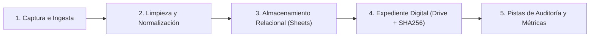
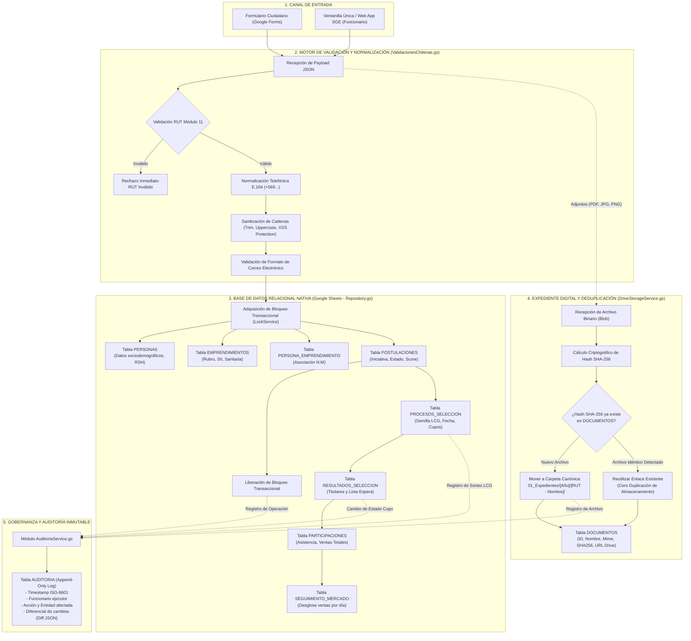
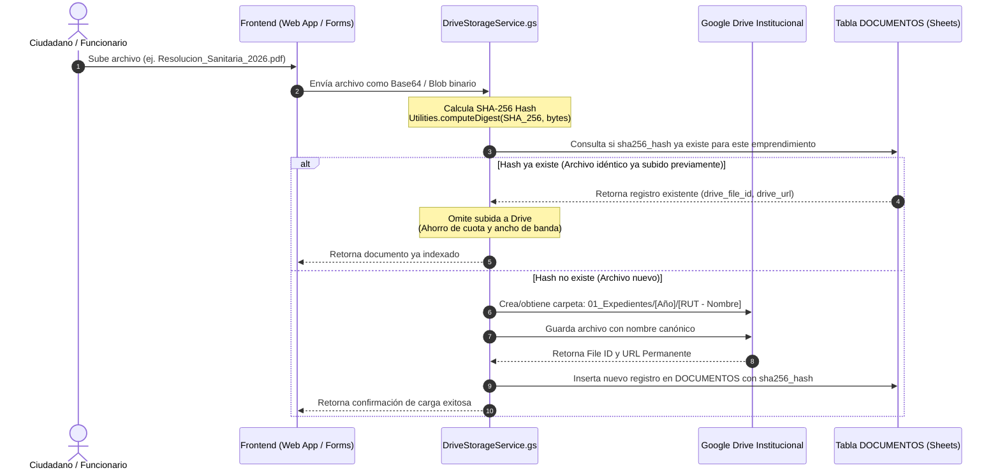
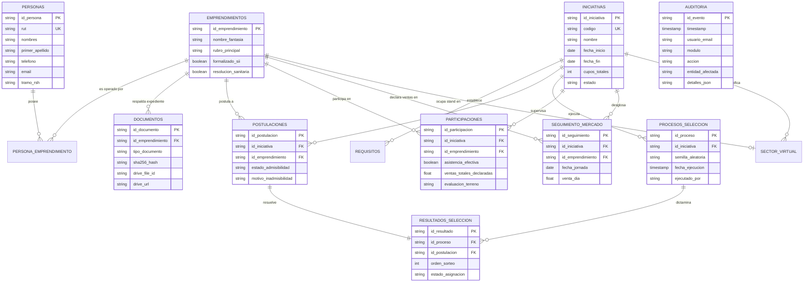

# FLUJOGRAMA DEL CICLO DE VIDA Y PROCESAMIENTO DE DATOS
## Arquitectura de Datos, Normalización y Seguridad (SGE v2.1.0)

> **Documento:** Ciclo de Vida y Flujo de Datos  
> **Destinatario:** Dirección de Informática y Telecomunicaciones  
> **Herramienta de Diagramación:** Mermaid GFM Compliant  

---

## 1. Visión Global de la Canalización de Datos (Data Pipeline)

El ciclo de vida de los datos en el SGE comprende **5 etapas controladas**, diseñadas para garantizar la integridad referencial, la no redundancia de archivos y la inmutabilidad de las auditorías:

---

## 2. Diagrama de Flujo del Procesamiento de Datos

El siguiente diagrama detalla cómo viaja la información desde que el ciudadano o funcionario ingresa un dato hasta su consolidación en el almacenamiento institucional:

---

## 3. Flujo Específico de Deduplicación y Gestión Documental (SHA-256)

El almacenamiento municipal en Google Drive se optimiza mediante el cálculo de un hash criptográfico sobre cada archivo cargado, evitando que un mismo documento (como una misma resolución sanitaria o cartola RSH subida varias veces) consuma espacio redundante:

---

## 4. Diagrama Entidad-Relación (ERD) del Modelo de Datos

Las 16 tablas operan de forma relacional bajo claves primarias de tipo UUID v4:

---

## 5. Garantías de Seguridad y Resguardo contra Pérdida de Datos

1. **Versionado de Archivos en Google Drive:**
   Toda modificación en un archivo o sustitución de cartola mantiene el historial de revisiones nativo de Google Drive, impidiendo el borrado accidental por parte de usuarios.
2. **Historial de Versiones en Google Sheets:**
   La base de datos cuenta con la funcionalidad nativa de Google Workspace para restaurar instantáneamente el libro a cualquier minuto exacto del tiempo en caso de error operacional humano.
3. **Bloqueo de Modificación en Tablas de Auditoría y Sorteo:**
   Las tablas `AUDITORIA`, `PROCESOS_SELECCION` y `RESULTADOS_SELECCION` son protegidas programáticamente: una vez insertado un sorteo, sus registros no admiten `UPDATE` ni `DELETE`, preservando la prueba documental para fiscalizaciones.
