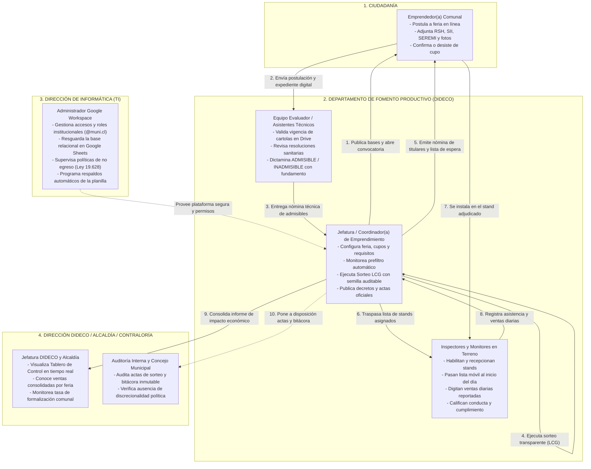

# ESPECIFICACIÓN FUNCIONAL Y ALCANCE DEL SISTEMA
## Sistema de Gestión y Asignación de Mercados de Emprendimiento (SGE v2.1.0)

> **Documento:** Alcance Funcional y Contenido Requerido del Sistema  
> **Destinatario:** Dirección de Informática / Jefatura de Fomento Productivo  
> **Objetivo:** Definir qué funciones realiza el sistema, qué componentes debe contener obligatoriamente y qué problemas resuelve en la gestión municipal, sin centrarse en el instructivo de instalación.

---

## 1. Propósito Fundamental: ¿Qué Problema Resuelve?

Históricamente, los municipios gestionan sus ferias y mercados de emprendimiento mediante planillas de cálculo sueltas (Excel), carpetas físicas y mensajería informal (WhatsApp). Esto genera:
1. **Asignación discrecional o cuestionable de puestos:** Reclamos ciudadanos y suspicacias de favoritismo ante la falta de un mecanismo transparente y comprobable.
2. **Duplicidad de documentos y pérdida de expedientes:** Ciudadanos obligados a entregar la misma cartola RSH o resolución sanitaria en cada feria a la que postulan.
3. **Puestos vacíos el día del evento:** Falta de un mecanismo ágil que promueva a los emprendedores de la lista de espera cuando un seleccionado titular no se presenta.
4. **Falta de métricas de impacto económico:** Imposibilidad de responder con datos duros cuánto dinero vendió la feria, qué rubros generan mayor retorno y cuál es la tasa de formalización comunal.

El **SGE** resuelve estos problemas unificando todo el ciclo de vida del emprendedor en una sola plataforma municipal nativa, transparente y auditable.

---

## 2. ¿Qué DEBE Contener el Sistema? (Módulos Obligatorios)

El sistema se compone de **9 módulos funcionales integrados**:

```
+-----------------------------------------------------------------------------------+
|                        SISTEMA DE GESTIÓN DE EMPRENDIMIENTO                       |
+-----------------------------------------------------------------------------------+
| 1. Padrón Único y Ficha Integral (Registro Maestro de Titulares y Negocios)      |
| 2. Expediente Digital Centralizado (Gestión y resguardo de documentos oficiales)  |
| 3. Motor de Validación Chilena y Prefiltro Automático (RUT, RSH, SII, SEREMI)    |
| 4. Catálogo de Convocatorias e Iniciativas (Ferias, Mercados, Expos, Cursos)     |
| 5. Motor de Sorteo Transparente con Semilla Auditable (Algoritmo LCG)            |
| 6. Asignador de Puestos y Cascada Dinámica (Promoción inmediata de lista espera)  |
| 7. Control Operativo en Terreno (Pase de lista y registro de ventas diarias)      |
| 8. Tablero de Control y Reportería de Impacto Económico (Dashboard Ejecutivo)     |
| 9. Bitácora de Auditoría Inmutable (Trazabilidad total para Contraloría/Concejo)  |
+-----------------------------------------------------------------------------------+
```

---

## 3. Detalle de Funciones por Módulo (¿Qué hace cada una?)

### MÓDULO 1: Padrón Único y Ficha Integral del Emprendedor
*Centraliza la identidad del postulante y su actividad comercial, evitando registros dispersos.*

- **Registro y Vinculación Persona-Emprendimiento:**
  - Modela la relación del titular con su negocio (separa los datos de la persona natural de los datos de la empresa o taller productivo).
  - Permite que una persona posea más de un emprendimiento o que varios socios compartan una unidad productiva.
- **Normalización de Datos de Contacto:**
  - Estandariza teléfonos a formato internacional E.164 (`+56 9 XXXXXXXX`) para llamadas y notificaciones automatizadas.
  - Almacena direcciones georreferenciadas (calle, número, villa/población y coordenadas) para mapeo territorial de la oferta productiva.
- **Historial de Vulnerabilidad y Formalización:**
  - Registra el tramo porcentual del Registro Social de Hogares (RSH: 40%, 60%, etc.).
  - Registra el estado tributario formal ante el SII (Primera/Segunda Categoría, sin inicio).

---

### MÓDULO 2: Expediente Digital Centralizado con Detección Antifraude
*Gestiona la evidencia física y digital de cada ciudadano en Google Drive institucional.*

- **Deduplicación Criptográfica (SHA-256):**
  - Al subir un archivo (cartola RSH, resolución sanitaria, cédula), el sistema calcula su huella digital criptográfica (hash SHA-256).
  - Si el mismo documento ya fue cargado con anterioridad, el sistema reutiliza el enlace existente, impidiendo el consumo redundante de espacio en Drive.
- **Estructuración Canónica de Carpetas:**
  - Ordena automáticamente los archivos en Drive bajo la jerarquía:  
    `01_Expedientes/[Año]/[RUT - Nombre Titular]/[Archivo]`.
- **Visor Rápido de Expediente:**
  - Permite al funcionario revisar en una sola ventana emergente si el emprendedor cuenta con fotos de productos, cartola RSH vigente o permiso sanitario, abriendo los archivos en Drive con un solo clic.

---

### MÓDULO 3: Motor de Reglas Normativas y Prefiltro Automático
*Filtra objetivamente a los postulantes antes de la evaluación humana.*

- **Validación Matemática de Cédula (Módulo 11):**
  - Bloquea cualquier ingreso de RUT falso, erróneo o mal digitado verificando el dígito verificador.
- **Cruce Automático de Criterios Excluyentes:**
  - **Filtro de Registro Social de Hogares:** Si las bases de la feria exigen un máximo de 60% de vulnerabilidad, el sistema detecta de forma automática a los postulantes que superan ese umbral.
  - **Filtro Sanitario por Rubro:** Si el postulante pertenece al rubro alimentos o cosmética y no posee resolución sanitaria vigente, el sistema lo marca como inadmisible para ese evento específico.
  - **Detección de Duplicados en la Convocatoria:** Impide que un mismo emprendedor postule dos veces a la misma feria.
- **Cálculo de Score / Puntaje Base:**
  - Asigna puntaje técnico según antigüedad, vulnerabilidad y estado de formalización para apoyar la priorización.

---

### MÓDULO 4: Gestión de Convocatorias e Iniciativas
*Administra los eventos comunales de fomento productivo.*

- **Parametrización del Evento:**
  - Configura nombre, código municipal, fechas de realización, fecha límite de postulación, lugar físico y total de stands disponibles.
- **Distribución de Cupos por Rubro (Zonificación):**
  - Permite reservar cuotas específicas de puestos por vocación (ej. 15 puestos para Artesanía, 10 para Alimentos elaborados, 5 para Plantas/Viveros).
- **Ciclo de Estados del Evento:**
  - Maneja la transición formal de estados: `Borrador` $\to$ `Convocatoria Abierta` $\to$ `En Evaluación` $\to$ `Selección Finalizada` $\to$ `En Ejecución` $\to$ `Cerrada`.

---

### MÓDULO 5: Motor de Selección Transparente y Sorteo Auditable
*Asigna los puestos de manera aleatoria e inobjetable mediante un algoritmo verificable.*

- **Algoritmo LCG (Generador Congruencial Lineal):**
  - Sustituye la selección a dedo por un bolillero digital matemático con semilla auditable.
- **Emisión de Acta Inmutable:**
  - Genera y registra en base de datos la semilla utilizada, la hora exacta de ejecución y el funcionario actuante.
  - Permite a la Contraloría, Concejo Municipal o gremios replicar el sorteo con la misma semilla para comprobar que el resultado es idéntico e inalterado.
- **Generación Dual de Listas:**
  - Divide automáticamente el universo de seleccionados en dos grupos:
    1. **Titulares Adjudicados:** Quienes obtienen el cupo directo (lugares 1 a N).
    2. **Lista de Espera Ordenada:** Prelación estricta para reemplazos (lugares N+1 en adelante).

---

### MÓDULO 6: Gestión de Confirmaciones y Asignación en Cascada
*Garantiza que el 100% de los stands se utilicen, eliminando los cupos abandonados.*

- **Control de Citación y Confirmación:**
  - Monitorea el plazo legal de confirmación del emprendedor (ej. 48 horas tras la notificación).
- **Algoritmo de Corrimiento en Cascada:**
  - Cuando un titular seleccionado desiste de participar o no responde en el plazo:
    1. El sistema marca al postulante como `DESISTIDO`.
    2. Toma de forma automática al postulante número 1 de la lista de espera.
    3. Lo promueve a `TITULAR_ASIGNADO` y emite la citación correspondiente.
  - El proceso no altera el orden de los demás postulantes ni requiere rehacer el sorteo.

---

### MÓDULO 7: Control Operativo en Terreno y Ventas Diarias
*Herramienta móvil para inspectores y encargados de feria durante el evento.*

- **Pase de Asistencia Digital:**
  - Permite marcar desde un teléfono móvil o tablet si el titular se presentó a montar su stand.
  - Registra inasistencias injustificadas para suspender al infractor de futuras convocatorias.
- **Registro Masivo de Ventas Diarias:**
  - Cuadrícula rápida donde el inspector digita las ventas brutas declaradas por cada puesto día por día.
- **Evaluación de Conducta y Normas:**
  - Calificación cualitativa (`Buena`, `Regular`, `Deficiente`) sobre cumplimiento de horario, orden y aseo del puesto.

---

### MÓDULO 8: Tablero de Control y Métricas de Impacto Económico
*Reportes ejecutivos automáticos para la Dirección de Desarrollo Comunitario y la Alcaldía.*

- **Métricas Consolidadas:**
  - Total de ventas inyectadas a la economía comunal en cada feria ($ CLP).
  - Venta promedio por rubro y por puesto.
  - Tasa de asistencia efectiva vs. inasistencia.
  - Porcentaje de formalización de los emprendedores que participan en ferias.
- **Exportación en Formato Estándar:**
  - Exportación inmediata a planillas Excel/CSV de la nómina completa de participantes con sus ventas y evaluaciones para la rendición municipal.

---

### MÓDULO 9: Bitácora Inmutable de Auditoría
*Resguardo legal y probatorio ante requerimientos de transparencia.*

- **Registro Append-Only (Solo Inserción):**
  - Toda acción crítica (quién modificó un estado, quién ejecutó el sorteo, quién dio de baja a un postulante) genera un registro inalterable.
- **Datos Registrados:**
  - Marca de tiempo exacta (ISO-8601), correo corporativo del funcionario, módulo, acción y diferencial de datos (valores previos y valores nuevos).

---

## 4. Reglas de Negocio Esenciales que el Sistema Debe Cumplir

| Regla | Descripción | Justificación |
| :--- | :--- | :--- |
| **RN-01: Cédula Única** | Un ciudadano solo puede existir una vez en el padrón bajo su RUT. | Evita registros duplicados y manipulación de perfiles. |
| **RN-02: Exigencia Sanitaria** | Rubros de alimentos requieren resolución SEREMI aprobada antes de ser admisibles. | Cumplimiento del Código Sanitario y resguardo de la salud pública. |
| **RN-03: Auditoría del Azar** | Todo sorteo debe almacenar su semilla criptográfica en base de datos. | Transparencia ante auditorías externas y concejales. |
| **RN-04: Cero Desperdicio** | Todo cupo desistido debe ofrecerse al primer lugar de la lista de espera. | Uso óptimo de los recursos e inversión municipal en toldos y seguridad. |
| **RN-05: Soberanía de Datos** | La información reside 100% en Google Workspace sin egreso a terceros. | Cumplimiento de la Ley 19.628 de Protección de Datos Personales. |

---

## 5. Flujogramas Departamentales: Funcionamiento y Procesamiento de Datos

### 5.1 Flujograma de Funcionamiento Operativo del Departamento (Roles y Gestión Inter-áreas)

Este diagrama ilustra cómo colaboran operativamente los distintos actores del Departamento de Fomento Productivo con la Dirección de Informática, la Alcaldía y la ciudadanía durante el ciclo completo de una feria:



---

### 5.2 Flujograma del Procesamiento y Ciclo de Datos del Departamento

Este diagrama muestra la **trazabilidad técnica de los datos**: desde que el ciudadano los digita, pasando por los filtros de depuración y resguardo criptográfico, hasta convertirse en reportes estratégicos para la autoridad comunal:

```mermaid
flowchart LR
    subgraph INGESTA ["1. ENTRADA DE DATOS"]
        direction TB
        IN_TXT["Datos Alfanuméricos<br/>- RUT Titular<br/>- Teléfono y Email<br/>- Nombre Fantasía<br/>- Tramo % RSH"]
        IN_DOC["Archivos Binarios<br/>- Cartola RSH (PDF)<br/>- Iniciación SII (PDF)<br/>- Res. Sanitaria (PDF)<br/>- Muestras (JPG/PNG)"]
    end

    subgraph DEPURACION ["2. LIMPIEZA Y RESGUARDO"]
        direction TB
        CLEAN_RUT["Validador Módulo 11<br/>- Corrige formato (12345678-5)<br/>- Bloquea RUT falso"]
        CLEAN_TEL["Normalizador E.164<br/>- Estandariza a +569..."]
        HASH_SHA["Motor SHA-256<br/>- Calcula hash único del archivo<br/>- Deduplica y evita almacenamiento redundante"]
    end

    subgraph NUCLEO_PERSISTENCIA ["3. PERSISTENCIA NATIVA (G-WORKSPACE)"]
        direction TB
        DB_SHEETS[("Google Sheets Relacional<br/>(16 Tablas Normalizadas)<br/>- PERSONAS<br/>- EMPRENDIMIENTOS<br/>- POSTULACIONES<br/>- PARTICIPACIONES")]
        DRIVE_EXP[("Google Drive Institucional<br/>(Expedientes Digitales)<br/>01_Expedientes/[Año]/[RUT]/...")]
    end

    subgraph MOTOR_DECISION ["4. PROCESAMIENTO Y DECISIÓN"]
        direction TB
        PRE_FILTER{"Prefiltro Normativo<br/>¿RSH <= Umbral?<br/>¿Tiene Res. Sanitaria si vende comida?"}
        DRAW_LCG["Motor de Sorteo LCG<br/>- Semilla generada<br/>- Separación Titulares / Espera"]
        CASCADE_ENGINE["Motor de Cascada<br/>- Corrimiento automático por deserciones"]
    end

    subgraph CAPTURA_TERRENO ["5. DATOS DE TERRENO"]
        direction TB
        FIELD_DATA["Captura Móvil en Feria<br/>- Asistencia efectiva (SI/NO)<br/>- Ventas diarias ($ CLP)<br/>- Observaciones de inspección"]
    end

    subgraph SALIDAS_REPORTABILIDAD ["6. SALIDAS E INTELIGENCIA MUNICIPAL"]
        direction TB
        OUT_ACTA["Acta Oficial de Selección<br/>(Descargable en Excel/PDF)"]
        OUT_DASH["Tablero Ejecutivo Alcaldía<br/>- Monto total transaccionado<br/>- Venta promedio por rubro"]
        OUT_AUDIT["Bitácora Inmutable (AUDITORIA)<br/>- Pista para Contraloría / Ley de Transparencia"]
    end

    %% Conexiones
    IN_TXT --> CLEAN_RUT & CLEAN_TEL
    IN_DOC --> HASH_SHA
    CLEAN_RUT & CLEAN_TEL --> DB_SHEETS
    HASH_SHA --> DRIVE_EXP
    DRIVE_EXP -.->|"Índice y URL"| DB_SHEETS

    DB_SHEETS --> PRE_FILTER
    PRE_FILTER -- "Admisibles" --> DRAW_LCG
    DRAW_LCG --> CASCADE_ENGINE
    CASCADE_ENGINE --> OUT_ACTA
    CASCADE_ENGINE --> FIELD_DATA
    FIELD_DATA --> DB_SHEETS

    DB_SHEETS --> OUT_DASH
    DRAW_LCG & CASCADE_ENGINE & FIELD_DATA -.->|"Log transaccional"| OUT_AUDIT
```



