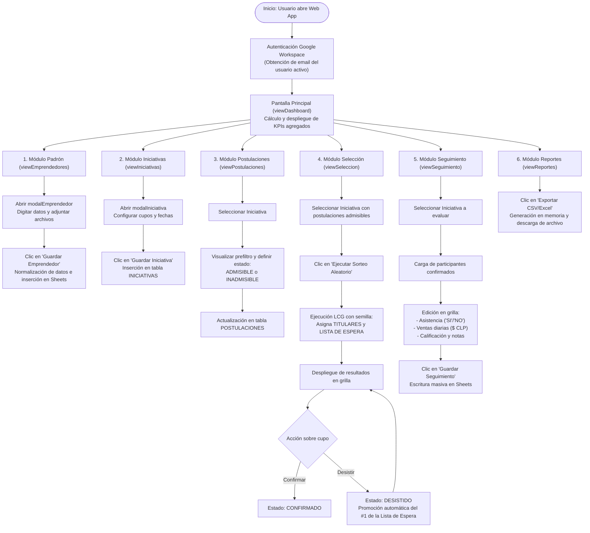

# ESPECIFICACIÓN FUNCIONAL Y ALCANCE DEL SISTEMA
## Sistema de Gestión y Asignación de Mercados de Emprendimiento (SGE v2.1.0)

> **Documento:** Especificación Funcional y Modelo de Datos  
> **Destinatario:** Dirección de Informática  
> **Alcance:** Exclusivamente las funcionalidades, interfaces, campos de datos y algoritmos implementados en el código fuente del sistema.  

---

## 1. Propósito y Alcance del Software

El **SGE v2.1.0** es una aplicación web (SPA) desarrollada sobre Google Apps Script V8 y Google Workspace, diseñada para resolver la gestión de datos de convocatorias comunales de emprendimiento. Su alcance técnico abarca:
1. **Centralización de Registros:** Sustitución de planillas dispersas por una base de datos relacional de 16 tablas en Google Sheets gobernada por `Repository.gs`.
2. **Expediente Digital Único:** Almacenamiento estructurado en Google Drive con deduplicación criptográfica (SHA-256) para evitar duplicidad de archivos.
3. **Validación Automática de Datos:** Filtro algorítmico de cédulas chilenas (Módulo 11), números telefónicos (E.164) y causales de admisibilidad.
4. **Asignación Aleatoria Auditable:** Algoritmo LCG (Generador Congruencial Lineal) con semilla para distribución imparcial de cupos y corrimiento en cascada ante deserciones.
5. **Captura y Consolidación de Métricas:** Registro de asistencia, captura de ventas diarias por participante y reportería de impacto económico.

---

## 2. Inventario de Módulos e Interfaces Implementadas

El sistema se estructura en las siguientes vistas e interfaces funcionales:

```
+-----------------------------------------------------------------------------------+
|                        MÓDULOS DE LA APLICACIÓN WEB (SPA)                         |
+-----------------------------------------------------------------------------------+
| 1. viewDashboard      : Métricas consolidadas, KPIs de ventas y gráficos visuales |
| 2. viewEmprendedores  : Padrón general, ficha persona-negocio y expediente digital|
| 3. viewIniciativas    : Catálogo de ferias/mercados, parametrización de cupos     |
| 4. viewPostulaciones  : Listado de postulaciones y filtro de admisibilidad        |
| 5. viewSeleccion      : Sorteo LCG con semilla, asignación y reemplazo en cascada |
| 6. viewSeguimiento    : Grilla masiva de asistencia ('SI'/'NO') y ventas diarias  |
| 7. viewReportes       : Exportación masiva de datos en formato CSV/Excel          |
| 8. viewConfiguracion  : Parámetros del sistema y configuración de almacenamiento  |
+-----------------------------------------------------------------------------------+
```

---

## 3. Detalle de Funciones por Módulo del Sistema

### MÓDULO 1: Padrón y Ficha Integral (`viewEmprendedores`)
- **Gestión de Entidades Persona y Emprendimiento:**
  - Formulario modal (`modalEmprendedor`) que captura en paralelo los datos de la persona natural (RUT, nombres, teléfono, domicilio, tramo RSH) y de su unidad económica (nombre de fantasía, rubro, subrubro, formalización SII, resolución sanitaria).
  - Normalización de datos en frontend y backend: RUT chileno formateado sin puntos con guion (`12345678-5`), teléfono a estándar internacional `+569XXXXXXXX`.
- **Expediente Digital (`modalDocumentos`):**
  - Consulta interactiva de archivos cargados en Google Drive mediante `apiListarDocumentosEmprendedor`.
  - Despliegue de semáforos de estado en pantalla: validación de fotos de muestra, vigencia de cartola RSH y resolución sanitaria según rubro.
  - Carga de nuevos archivos con cálculo automático de hash SHA-256 en backend (`DriveStorageService.gs`).

### MÓDULO 2: Gestión de Convocatorias e Iniciativas (`viewIniciativas`)
- **Parametrización de Mercados:**
  - Formulario modal (`modalIniciativa`) para crear o editar registros en la tabla `INICIATIVAS`.
  - Campos: código identificador, nombre de la feria, tipo de evento, fechas de inicio y término, plazo fatal de postulación, dirección y total de cupos disponibles.
- **Transición de Estados de la Iniciativa:**
  - Control de estados: `BORRADOR` $\to$ `CONVOCATORIA_ABIERTA` $\to$ `EN_EVALUACION` $\to$ `SELECCION_FINALIZADA` $\to$ `EN_EJECUCION` $\to$ `CERRADA`.

### MÓDULO 3: Gestión de Postulaciones y Prefiltro (`viewPostulaciones`)
- **Listado y Filtrado:**
  - Carga dinámica de postulantes asociados a una iniciativa seleccionada (`apiPostulacionesPorIniciativa`).
- **Prefiltro Automático de Admisibilidad:**
  - Cruce de datos del postulante contra los requisitos de la iniciativa: verificación de tramo RSH máximo permitido y existencia de resolución sanitaria para rubros alimentarios.
- **Dictamen de Estado:**
  - Actualización interactiva del campo `estado_admisibilidad`: selección entre `PENDIENTE`, `ADMISIBLE` o `INADMISIBLE`.
  - Campo de texto obligatorio para registrar la justificación en la tabla `POSTULACIONES`.

### MÓDULO 4: Motor de Sorteo LCG y Asignación en Cascada (`viewSeleccion`)
- **Algoritmo de Sorteo LCG (Linear Congruential Generator):**
  - Botón "Ejecutar Sorteo Aleatorio" (`apiEjecutarSorteo`).
  - El backend toma las postulaciones con estado `ADMISIBLE`, genera una semilla numérica auditable ($X_0$) a partir del timestamp criptográfico y aplica la relación congruencial para ordenar a los postulantes:
    $$X_{n+1} = (a \cdot X_n + c) \pmod m$$
  - Distribuye el resultado en dos listas:
    1. **Titulares Asignados:** Posiciones 1 hasta $N$ (donde $N$ es el total de cupos de la iniciativa).
    2. **Lista de Espera:** Posiciones $N+1$ en adelante, ordenadas estrictamente por orden de sorteo.
- **Acciones de Cupo y Cascada Dinámica:**
  - **Confirmar Cupo:** Botón que actualiza el estado a `CONFIRMADO` en la tabla `RESULTADOS_SELECCION`.
  - **Desistir Cupo:** Botón que marca al titular en estado `DESISTIDO` y dispara el algoritmo de reemplazo en cascada (`apiDesistirCupo`):
    1. Localiza al primer registro en `LISTA_ESPERA`.
    2. Actualiza atómicamente su estado a `TITULAR_ASIGNADO`.
    3. Registra el evento en la tabla `AUDITORIA` y refresca la grilla en pantalla.

### MÓDULO 5: Grilla de Seguimiento y Captura de Ventas (`viewSeguimiento`)
- **Carga de Participantes por Iniciativa:**
  - Selector de mercado que consulta a `apiListarParticipantesSeguimiento` para poblar la grilla con los titulares confirmados.
- **Edición en Grilla:**
  - Campo selector de asistencia: `SI` o `NO`.
  - Entradas numéricas por jornada para capturar el monto de venta diaria declarado en pesos ($ CLP).
  - Campo selector de evaluación cualitativa: `BUENA`, `REGULAR` o `DEFICIENTE`.
  - Campo de texto libre para observaciones técnicas.
- **Persistencia Masiva Atómica:**
  - Botón "Guardar Seguimiento" (`apiGuardarSeguimientoMasivo`).
  - Utiliza `LockService` para escribir de forma concurrente en las tablas `PARTICIPACIONES` (totales acumulados) y `SEGUIMIENTO_MERCADO` (desglose por día).

### MÓDULO 6: Tablero de Control y Reportería (`viewDashboard` / `viewReportes`)
- **Visualización de KPIs:**
  - Tarjetas con monto total acumulado de ventas transaccionadas en ferias.
  - Tasa de asistencia efectiva sobre stands asignados.
  - Distribución de emprendedores según estado formal ante el SII.
- **Exportación de Datos:**
  - Generación en memoria y descarga en el navegador de archivos `.csv` compatibles con Excel:
    - *Reporte de Mercado:* Detalle de participantes con ventas diarias, total acumulado y asistencia.
    - *Padrón Comunal:* Nómina completa de personas y unidades productivas con datos de contacto normalizados.

---

## 4. Reglas de Negocio Implementadas en Código

| Regla | Implementación en Código | Validación / Control |
| :--- | :--- | :--- |
| **RUT Módulo 11** | `ValidacionesChilenas.gs` / `validarRutChileno()` | Multiplicadores 2 a 7, suma ponderada, verificación de dígito verificador (0-9, K). |
| **Deduplicación SHA-256** | `DriveStorageService.gs` / `calcularHashSha256_()` | Cálculo de hash criptográfico sobre el blob. Si existe en `DOCUMENTOS`, reutiliza URL. |
| **Atomicidad de Escritura** | `Repository.gs` / `LockService.getScriptLock()` | Bloqueo de hasta 30 segundos en inserciones y actualizaciones sobre Google Sheets. |
| **Sorteo Reproducible** | `SeleccionService.gs` / `generarSorteoLcg_()` | Registro de `semilla_aleatoria` en `PROCESOS_SELECCION` para verificación de resultados. |
| **Cascada Inmediata** | `SeleccionService.gs` / `desistirYPromoverCascada()` | Actualización atómica de estados sin alterar el orden del bolillero. |

---

## 5. Flujogramas de Operación y Procesamiento de Datos del Sistema

### 5.1 Flujograma de Navegación y Operación de Datos por Interfaz

Este diagrama ilustra la secuencia de interacción del usuario con las vistas y controles de la aplicación web:


```mermaid
flowchart TD
    Start(["Inicio: Usuario abre Web App"]) --> AUTH["Autenticación Google Workspace<br/>(Obtención de email del usuario activo)"]
    AUTH --> DASH["Pantalla Principal (viewDashboard)<br/>Cálculo y despliegue de KPIs agregados"]
    
    %% Navegación por Módulos
    DASH --> NAV_EMP["1. Módulo Padrón (viewEmprendedores)"]
    DASH --> NAV_INI["2. Módulo Iniciativas (viewIniciativas)"]
    DASH --> NAV_POST["3. Módulo Postulaciones (viewPostulaciones)"]
    DASH --> NAV_SEL["4. Módulo Selección (viewSeleccion)"]
    DASH --> NAV_SEG["5. Módulo Seguimiento (viewSeguimiento)"]
    DASH --> NAV_REP["6. Módulo Reportes (viewReportes)"]
    
    %% Módulo Padrón
    NAV_EMP --> FORM_EMP["Abrir modalEmprendedor<br/>Digitar datos y adjuntar archivos"]
    FORM_EMP --> SAVE_EMP["Clic en 'Guardar Emprendedor'<br/>Normalización de datos e inserción en Sheets"]
    
    %% Módulo Iniciativas
    NAV_INI --> FORM_INI["Abrir modalIniciativa<br/>Configurar cupos y fechas"]
    FORM_INI --> SAVE_INI["Clic en 'Guardar Iniciativa'<br/>Inserción en tabla INICIATIVAS"]
    
    %% Módulo Postulaciones
    NAV_POST --> SEL_INI_POST["Seleccionar Iniciativa"]
    SEL_INI_POST --> EVAL_ADM["Visualizar prefiltro y definir estado:<br/>ADMISIBLE o INADMISIBLE"]
    EVAL_ADM --> SAVE_POST["Actualización en tabla POSTULACIONES"]
    
    %% Módulo Selección
    NAV_SEL --> SEL_INI_DRA["Seleccionar Iniciativa con postulaciones admisibles"]
    SEL_INI_DRA --> BTN_DRA["Clic en 'Ejecutar Sorteo Aleatorio'"]
    BTN_DRA --> CALC_LCG["Ejecución LCG con semilla:<br/>Asigna TITULARES y LISTA DE ESPERA"]
    CALC_LCG --> GRID_DRA["Despliegue de resultados en grilla"]
    GRID_DRA --> ACT_CUPO{"Acción sobre cupo"}
    ACT_CUPO -- "Confirmar" --> SAVE_CONF["Estado: CONFIRMADO"]
    ACT_CUPO -- "Desistir" --> RUN_CASCADE["Estado: DESISTIDO<br/>Promoción automática del #1 de la Lista de Espera"]
    RUN_CASCADE --> GRID_DRA
    
    %% Módulo Seguimiento
    NAV_SEG --> SEL_INI_SEG["Seleccionar Iniciativa a evaluar"]
    SEL_INI_SEG --> LOAD_SEG["Carga de participantes confirmados"]
    LOAD_SEG --> EDIT_SEG["Edición en grilla:<br/>- Asistencia ('SI'/'NO')<br/>- Ventas diarias ($ CLP)<br/>- Calificación y notas"]
    EDIT_SEG --> BTN_SAVE_SEG["Clic en 'Guardar Seguimiento'<br/>Escritura masiva en Sheets"]
    
    %% Módulo Reportes
    NAV_REP --> BTN_EXP["Clic en 'Exportar CSV/Excel'<br/>Generación en memoria y descarga de archivo"]
```

---

### 5.2 Flujograma del Procesamiento y Ciclo de Datos

Este diagrama representa el ciclo de procesamiento técnico desde la captura hasta la salida de datos:


```mermaid
flowchart LR
    subgraph ENTRADA ["1. ENTRADA DE DATOS"]
        direction TB
        IN_TXT["Datos Alfanuméricos<br/>- RUT, nombres, contactos<br/>- Tramo RSH, iniciación SII<br/>- Fechas y cupos de feria"]
        IN_BLOB["Archivos Binarios<br/>- Cartola RSH (PDF)<br/>- Res. Sanitaria (PDF)<br/>- Fotos de productos (JPG/PNG)"]
    end

    subgraph PROCESAMIENTO_INICIAL ["2. SANITIZACIÓN Y HASHING"]
        direction TB
        VAL_RUT["Validador Módulo 11<br/>Formato canónico 12345678-5"]
        VAL_TEL["Normalizador E.164<br/>Prefijo +569..."]
        CALC_HASH["Cálculo SHA-256<br/>Detección de duplicados"]
    end

    subgraph PERSISTENCIA ["3. CAPA DE PERSISTENCIA"]
        direction TB
        SHEETS_DB[("Google Sheets (16 Tablas)<br/>Repository.gs con LockService")]
        DRIVE_FS[("Google Drive Institucional<br/>01_Expedientes/[Año]/[RUT]/...")]
    end

    subgraph ALGORITMOS ["4. MOTORES DE CÁLCULO"]
        direction TB
        RULE_PRE{"Prefiltro de Admisibilidad<br/>Cruce RSH / Sanitaria"}
        ALGO_LCG["Sorteo Aleatorio LCG<br/>Semilla criptográfica"]
        ALGO_CAS["Motor de Cascada<br/>Promoción atómica"]
    end

    subgraph REGISTRO_SEGUIMIENTO ["5. CAPTURA OPERATIVA"]
        direction TB
        INPUT_GRID["Registro de Grilla<br/>- Asistencia efectiva<br/>- Ventas por jornada ($ CLP)"]
    end

    subgraph SALIDAS ["6. SALIDAS DEL SISTEMA"]
        direction TB
        OUT_GRID["Grillas y Vistas en Pantalla"]
        OUT_CSV["Exportaciones CSV / Excel"]
        OUT_AUDIT[("Tabla AUDITORIA<br/>(Append-Only Log)")]
    end

    %% Conexiones
    IN_TXT --> VAL_RUT & VAL_TEL
    IN_BLOB --> CALC_HASH
    VAL_RUT & VAL_TEL --> SHEETS_DB
    CALC_HASH --> DRIVE_FS
    DRIVE_FS -.->|"URL y File ID"| SHEETS_DB

    SHEETS_DB --> RULE_PRE
    RULE_PRE -- "Admisibles" --> ALGO_LCG
    ALGO_LCG --> ALGO_CAS
    ALGO_CAS --> INPUT_GRID
    INPUT_GRID --> SHEETS_DB

    SHEETS_DB --> OUT_GRID & OUT_CSV
    ALGO_LCG & ALGO_CAS & INPUT_GRID -.->|"Registro de evento"| OUT_AUDIT
```
